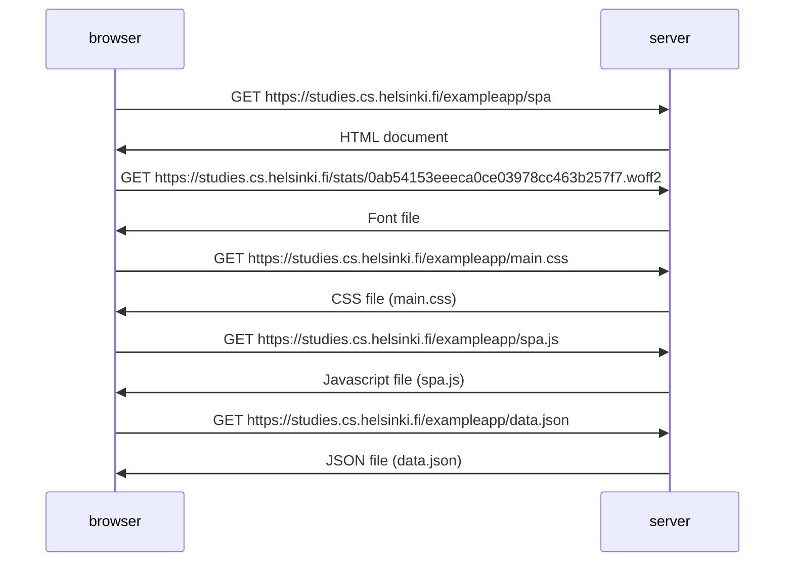

```mermaid
sequenceDiagram
  participant browser
  participant server

  browser->>server: GET https://studies.cs.helsinki.fi/exampleapp/spa
  server->>browser: HTML document

  browser->>server: GET https://studies.cs.helsinki.fi/stats/0ab54153eeeca0ce03978cc463b257f7.woff2
  server->>browser: Font file

  browser->>server: GET https://studies.cs.helsinki.fi/exampleapp/main.css
  server->>browser: CSS file (main.css)

  browser->>server: GET https://studies.cs.helsinki.fi/exampleapp/spa.js
  server->>browser: Javascript file (spa.js)

  browser->>server: GET https://studies.cs.helsinki.fi/exampleapp/data.json
  server->>browser: JSON file (data.json)
```
